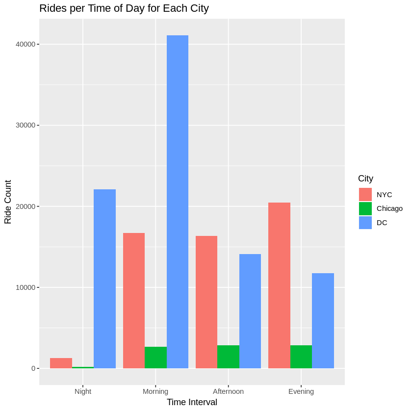
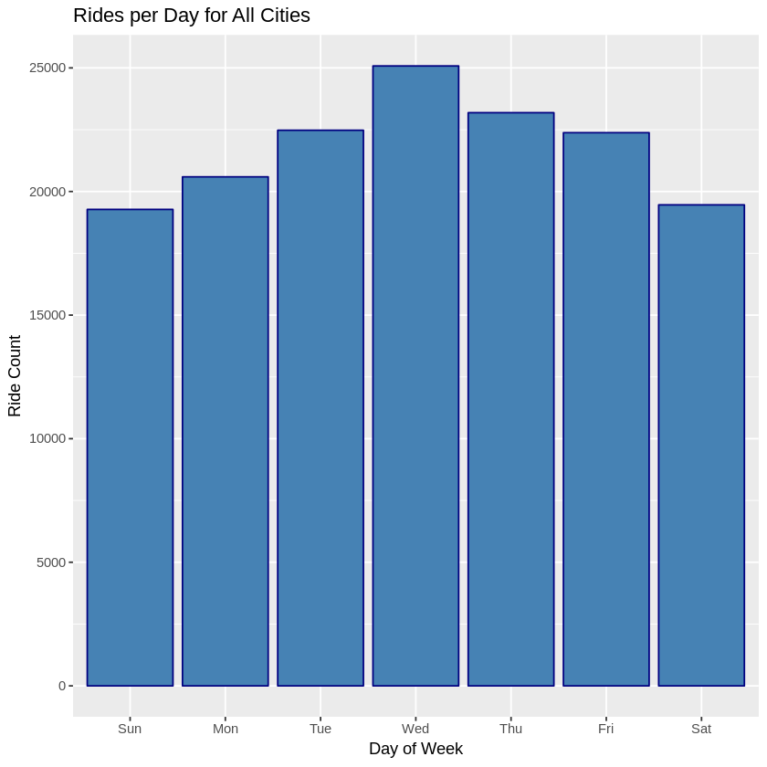
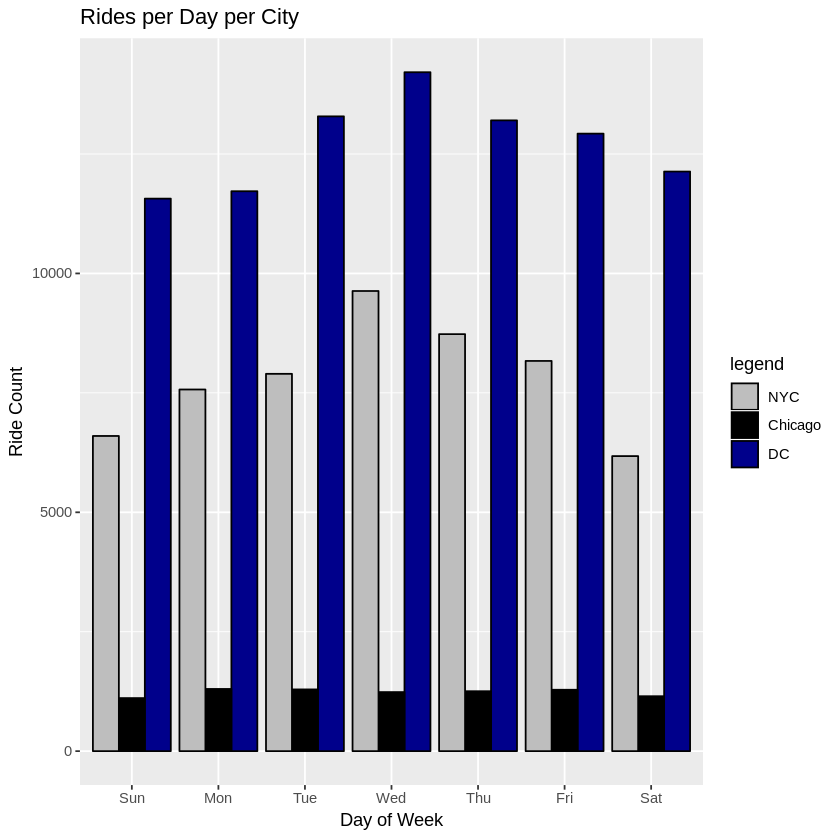
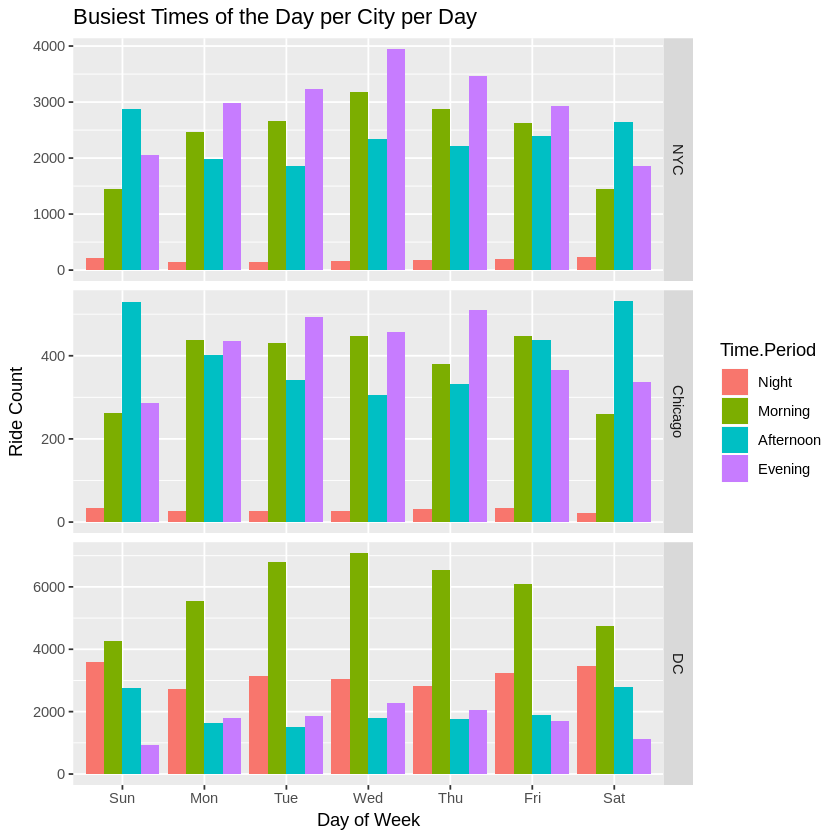
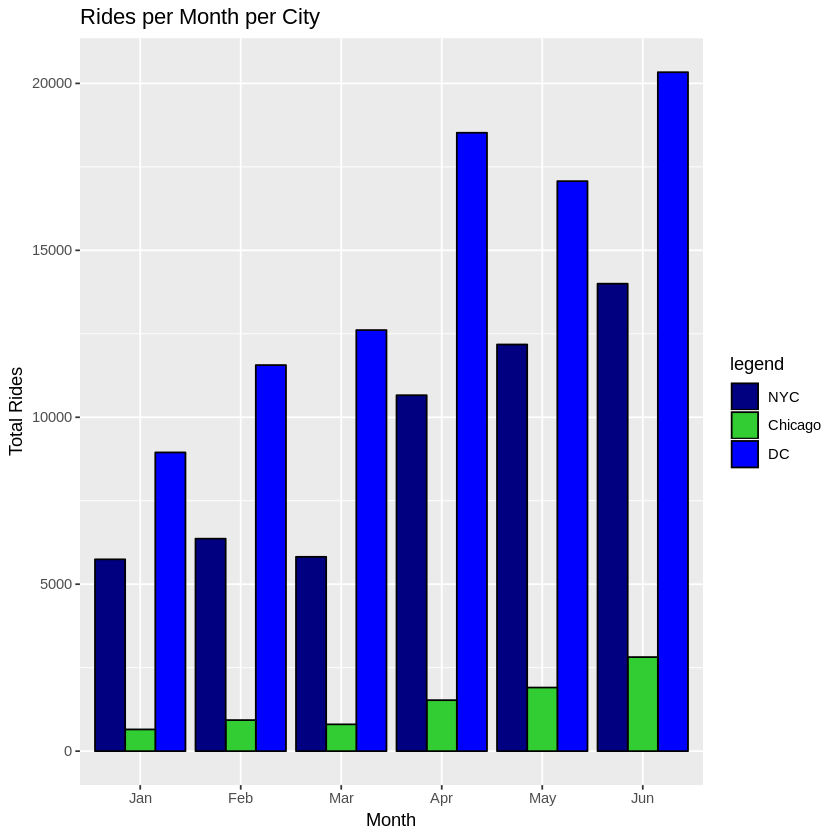
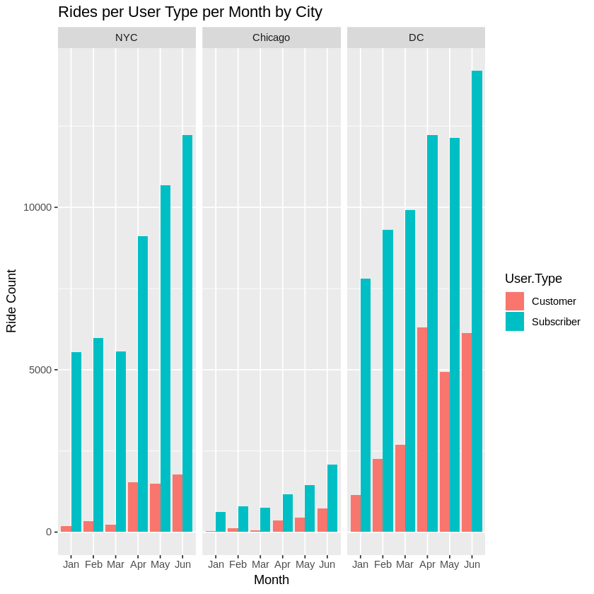
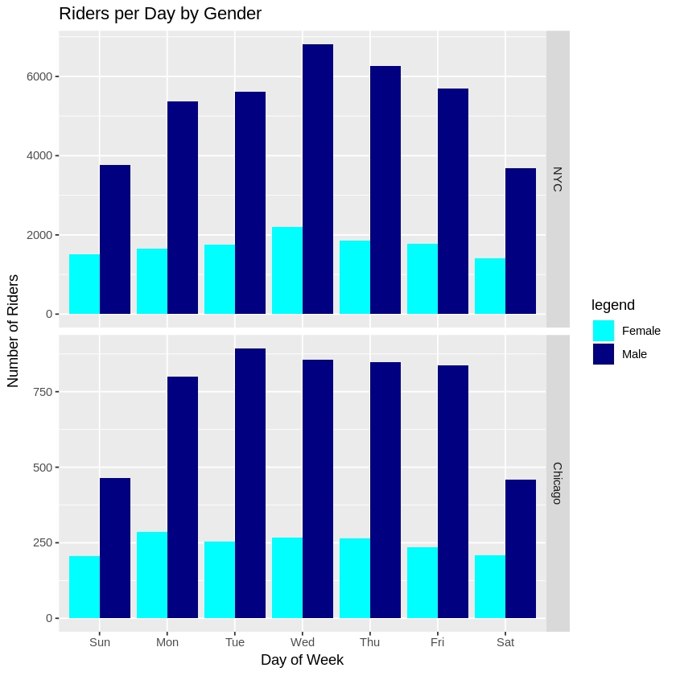
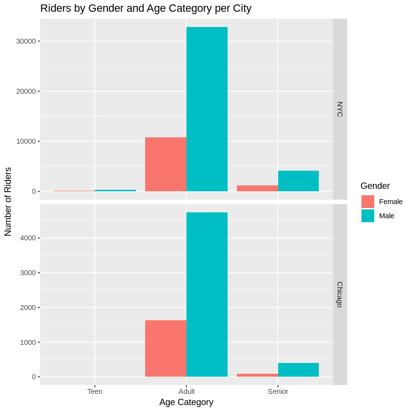
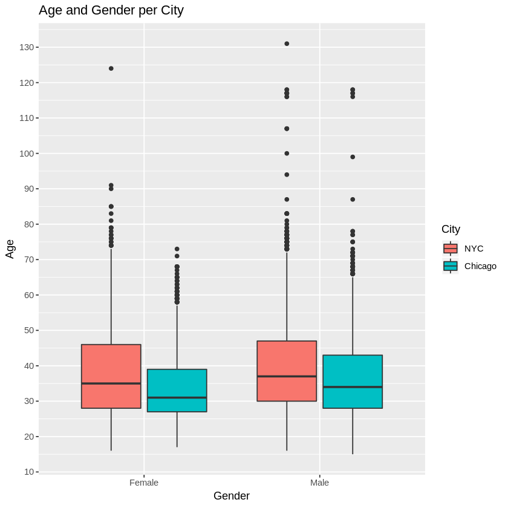
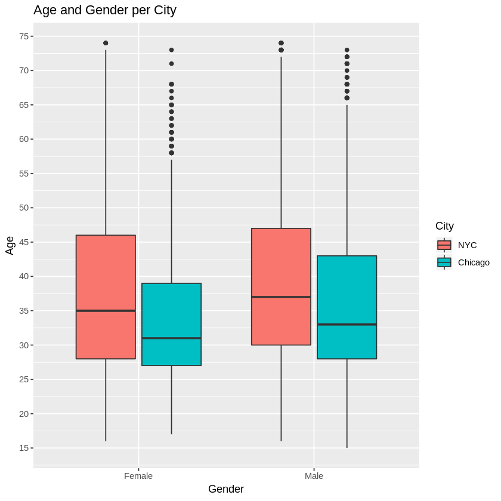

## Explore Bike Share Data

For this project, your goal is to ask and answer three questions about the available bikeshare data from Washington, Chicago, and New York.  This notebook can be submitted directly through the workspace when you are confident in your results.

You will be graded against the project [Rubric](https://review.udacity.com/#!/rubrics/2508/view) by a mentor after you have submitted.  To get you started, you can use the template below, but feel free to be creative in your solutions!

### Loading Libraries 


```R
library(dplyr)
library(tidyr)
library(timeDate)
library(tidyverse)
library(ggplot2)
library(lubridate)
```

    
    Attaching package: ‘dplyr’
    
    The following objects are masked from ‘package:stats’:
    
        filter, lag
    
    The following objects are masked from ‘package:base’:
    
        intersect, setdiff, setequal, union
    
    ── Attaching packages ─────────────────────────────────────── tidyverse 1.2.1 ──
    ✔ ggplot2 3.1.0     ✔ purrr   0.2.5
    ✔ tibble  2.0.1     ✔ stringr 1.3.1
    ✔ readr   1.3.1     ✔ forcats 0.3.0
    ── Conflicts ────────────────────────────────────────── tidyverse_conflicts() ──
    ✖ dplyr::filter() masks stats::filter()
    ✖ dplyr::lag()    masks stats::lag()
    
    Attaching package: ‘lubridate’
    
    The following object is masked from ‘package:base’:
    
        date
    


### Reading from CSV files


```R
ny = read.csv('new_york_city.csv')
wash = read.csv('washington.csv')
chi = read.csv('chicago.csv')
```

### Data Wrangling

1. The Start.Time and End.Time factor formats for all three tables need to be formatted to an appropriate date time format in order to do Exploratory Data Analysis.
2. A Gender column needs to be created and added to the Washington table in order to have the same column count.
3. A Birth.Year column needs to be created and added to the Washington table in order to have the same column count.
4. A city column needs to be created for each table to identify the city.
5. The three tables need to be joined into a master table.
6. Adding new variables (Time.Period, Time, Month, and Day.of.Week) for later EDA.
7. Creating a new variable to add to the table called Age (Year of data minus riders' birth year).
8. Creating age category labels to make EDA easier to perform.

### Datasets

1. Time: January - June 2017
2. Cities: New York City, Chicago, and Washington DC
3. Start Time measured in year-month-day hour:minute:second 
4. Trip Duration measured in seconds. 
5. Start Station measured by intersection such as  Broadway & Barry Ave.
6. End Station measured by intersection such as Sedgwick St & North Ave.
7. User Type: Subscriber or Customer.
____
8. Gender: only in New York City and Chicago, excluding DC.
9. Birth Year: only in New York City and Chicago, excluding DC.


#### Inspecting column names and quanity of columns


```R
names(ny)
ncol(ny)
```


<ol class=list-inline>
	<li>'X'</li>
	<li>'Start.Time'</li>
	<li>'End.Time'</li>
	<li>'Trip.Duration'</li>
	<li>'Start.Station'</li>
	<li>'End.Station'</li>
	<li>'User.Type'</li>
	<li>'Gender'</li>
	<li>'Birth.Year'</li>
</ol>


9


```R
names(chi)
ncol(chi)
```


<ol class=list-inline>
	<li>'X'</li>
	<li>'Start.Time'</li>
	<li>'End.Time'</li>
	<li>'Trip.Duration'</li>
	<li>'Start.Station'</li>
	<li>'End.Station'</li>
	<li>'User.Type'</li>
	<li>'Gender'</li>
	<li>'Birth.Year'</li>
</ol>


9


```R
names(wash)
ncol(wash)
```


<ol class=list-inline>
	<li>'X'</li>
	<li>'Start.Time'</li>
	<li>'End.Time'</li>
	<li>'Trip.Duration'</li>
	<li>'Start.Station'</li>
	<li>'End.Station'</li>
	<li>'User.Type'</li>
</ol>


7


```R
# Verifying that the three columns are not equal.
ncol(ny) == ncol(chi) & ncol(wash) == ncol(ny) 
```


FALSE


#### Inspecting Data Frames


```R
class(ny)
class(chi)
class(wash)
```


'data.frame'


'data.frame'


'data.frame'


```R
head(ny,2)
```


<table>
<thead><tr><th scope=col>X</th><th scope=col>Start.Time</th><th scope=col>End.Time</th><th scope=col>Trip.Duration</th><th scope=col>Start.Station</th><th scope=col>End.Station</th><th scope=col>User.Type</th><th scope=col>Gender</th><th scope=col>Birth.Year</th></tr></thead>
<tbody>
	<tr><td>5688089                    </td><td>2017-06-11 14:55:05        </td><td>2017-06-11 15:08:21        </td><td>795                        </td><td>Suffolk St &amp; Stanton St</td><td>W Broadway &amp; Spring St </td><td>Subscriber                 </td><td>Male                       </td><td>1998                       </td></tr>
	<tr><td>4096714                                                           </td><td>2017-05-11 15:30:11                                               </td><td>2017-05-11 15:41:43                                               </td><td>692                                                               </td><td>Lexington Ave &amp; E 63 St                                       </td><td><span style=white-space:pre-wrap>1 Ave &amp; E 78 St       </span></td><td>Subscriber                                                        </td><td>Male                                                              </td><td>1981                                                              </td></tr>
</tbody>
</table>


```R
head(chi,2)
```


<table>
<thead><tr><th scope=col>X</th><th scope=col>Start.Time</th><th scope=col>End.Time</th><th scope=col>Trip.Duration</th><th scope=col>Start.Station</th><th scope=col>End.Station</th><th scope=col>User.Type</th><th scope=col>Gender</th><th scope=col>Birth.Year</th></tr></thead>
<tbody>
	<tr><td>1423854                                                                 </td><td>2017-06-23 15:09:32                                                     </td><td>2017-06-23 15:14:53                                                     </td><td> 321                                                                    </td><td>Wood St &amp; Hubbard St                                                </td><td><span style=white-space:pre-wrap>Damen Ave &amp; Chicago Ave     </span></td><td>Subscriber                                                              </td><td><span style=white-space:pre-wrap>Male  </span>                          </td><td>1992                                                                    </td></tr>
	<tr><td> 955915                         </td><td>2017-05-25 18:19:03             </td><td>2017-05-25 18:45:53             </td><td>1610                            </td><td>Theater on the Lake             </td><td>Sheffield Ave &amp; Waveland Ave</td><td>Subscriber                      </td><td>Female                          </td><td>1992                            </td></tr>
</tbody>
</table>


```R
head(wash,2)
```


<table>
<thead><tr><th scope=col>X</th><th scope=col>Start.Time</th><th scope=col>End.Time</th><th scope=col>Trip.Duration</th><th scope=col>Start.Station</th><th scope=col>End.Station</th><th scope=col>User.Type</th></tr></thead>
<tbody>
	<tr><td>1621326                                                                 </td><td>2017-06-21 08:36:34                                                     </td><td>2017-06-21 08:44:43                                                     </td><td>489.066                                                                 </td><td><span style=white-space:pre-wrap>14th &amp; Belmont St NW      </span>  </td><td><span style=white-space:pre-wrap>15th &amp; K St NW              </span></td><td>Subscriber                                                              </td></tr>
	<tr><td> 482740                         </td><td>2017-03-11 10:40:00             </td><td>2017-03-11 10:46:00             </td><td>402.549                         </td><td>Yuma St &amp; Tenley Circle NW  </td><td>Connecticut Ave &amp; Yuma St NW</td><td>Subscriber                      </td></tr>
</tbody>
</table>


```R
# New York table structure.
str(ny)
```

    'data.frame':	54770 obs. of  9 variables:
     $ X            : int  5688089 4096714 2173887 3945638 6208972 1285652 1675753 1692245 2271331 1558339 ...
     $ Start.Time   : Factor w/ 54568 levels "2017-01-01 00:17:01",..: 45448 32799 17316 31589 49688 10220 13390 13509 18111 12449 ...
     $ End.Time     : Factor w/ 54562 levels "201","2017-01-01 00:30:56",..: 45432 32783 17295 31567 49668 10204 13364 13505 18092 12422 ...
     $ Trip.Duration: int  795 692 1325 703 329 998 478 4038 5132 309 ...
     $ Start.Station: Factor w/ 636 levels "","1 Ave & E 16 St",..: 522 406 10 93 5 521 325 309 151 245 ...
     $ End.Station  : Factor w/ 638 levels "","1 Ave & E 16 St",..: 613 8 362 558 269 107 389 110 151 243 ...
     $ User.Type    : Factor w/ 3 levels "","Customer",..: 3 3 3 3 3 3 3 3 2 3 ...
     $ Gender       : Factor w/ 3 levels "","Female","Male": 3 3 3 2 3 3 3 3 1 3 ...
     $ Birth.Year   : num  1998 1981 1987 1986 1992 ...


```R
# Chicago table structure.
str(chi)
```

    'data.frame':	8630 obs. of  9 variables:
     $ X            : int  1423854 955915 9031 304487 45207 1473887 961916 65924 606841 135470 ...
     $ Start.Time   : Factor w/ 8624 levels "2017-01-01 00:40:14",..: 7876 5303 73 1721 267 8173 5347 368 3376 795 ...
     $ End.Time     : Factor w/ 8625 levels "2017-01-01 00:46:32",..: 7876 5303 73 1722 267 8173 5346 368 3376 796 ...
     $ Trip.Duration: int  321 1610 416 350 534 586 281 723 689 493 ...
     $ Start.Station: Factor w/ 472 levels "2112 W Peterson Ave",..: 468 424 291 80 103 119 22 255 374 420 ...
     $ End.Station  : Factor w/ 471 levels "","2112 W Peterson Ave",..: 132 381 469 409 151 70 467 251 200 118 ...
     $ User.Type    : Factor w/ 3 levels "","Customer",..: 3 3 3 3 3 3 3 2 3 3 ...
     $ Gender       : Factor w/ 3 levels "","Female","Male": 3 2 3 3 3 3 2 1 3 3 ...
     $ Birth.Year   : num  1992 1992 1981 1986 1975 ...


```R
# Washington table structure.
str(wash)
```

    'data.frame':	89051 obs. of  7 variables:
     $ X            : int  1621326 482740 1330037 665458 1481135 1148202 1594275 1601832 574182 327058 ...
     $ Start.Time   : Factor w/ 81223 levels "","2017-01-01 00:11:00",..: 74753 19510 59964 26708 67716 50891 73381 73775 23142 13333 ...
     $ End.Time     : Factor w/ 81217 levels "","2017-01-01 00:14:00",..: 74744 19473 59981 26732 67753 50918 73397 73775 23114 13350 ...
     $ Trip.Duration: num  489 403 637 1827 1549 ...
     $ Start.Station: Factor w/ 478 levels "","10th & E St NW",..: 27 478 66 221 278 84 368 82 71 60 ...
     $ End.Station  : Factor w/ 479 levels "","10th & E St NW",..: 47 219 144 312 315 239 162 376 51 308 ...
     $ User.Type    : Factor w/ 3 levels "","Customer",..: 3 3 3 2 3 3 3 3 3 3 ...


#### Inspecting any missing values


```R
# Missing values for ny table.
sum(is.na(ny))
```


5219


```R
# Missing values for the Trip.Duration column in ny table.
sum(is.na(ny$Trip.Duration))
```


1


```R
# Missing values for the Birth.Year colum in ny table.
sum(is.na(ny$Birth.Year))
```


5218


```R
# The total missing values in ny data frame from Trip.Duration and Birth.Year.
sum(is.na(ny)) == (sum(is.na(ny$Trip.Duration)) + sum(is.na(ny$Birth.Year)))
```


TRUE


```R
empty.values.search <- function(state,variable){
    #` Function to find empty values in state table.`
    return (count(filter(state, state[[variable]] =='')))    
}
```


```R
# Searching for any empty values in Gender variable for ny table.
empty.values.search(ny,"Gender")
```


<table>
<thead><tr><th scope=col>n</th></tr></thead>
<tbody>
	<tr><td>5410</td></tr>
</tbody>
</table>


```R
# Converting the empty values into NA values to later do EDA.
ny$Gender[ny$Gender==''] <- NA
```


```R
# Verifying the empty values have been turned into NA values.
empty.values.search(ny,"Gender")
```


<table>
<thead><tr><th scope=col>n</th></tr></thead>
<tbody>
	<tr><td>0</td></tr>
</tbody>
</table>


```R
# Missing values for chi table.
sum(is.na(chi))
```


1747


```R
# All Missing values come from Birth.Year column in chi table.
sum(is.na(chi$Birth.Year))
```


1747


```R
# Using function to find missing Gender values in chi table.
empty.values.search(chi,"Gender")
```


<table>
<thead><tr><th scope=col>n</th></tr></thead>
<tbody>
	<tr><td>1748</td></tr>
</tbody>
</table>


```R
# Converting the empty values into NA values to later do EDA.
chi$Gender[chi$Gender==''] <- NA
```


```R
# Verifying that the empty values are zero.
count(filter(chi, Gender==''))
```


<table>
<thead><tr><th scope=col>n</th></tr></thead>
<tbody>
	<tr><td>0</td></tr>
</tbody>
</table>


```R
# Missing values for wash table.
sum(is.na(wash))
```


1


```R
# Missing value comes from Trip.Duration in wash table.
sum(is.na(wash$Trip.Duration))
```


1


```R
# Searching for any empty values in Start.Station variable for wash table.
empty.values.search(wash,"Start.Station")
```


<table>
<thead><tr><th scope=col>n</th></tr></thead>
<tbody>
	<tr><td>1</td></tr>
</tbody>
</table>


```R
# Converting the empty values into NA values to later do EDA.
wash$Start.Station[wash$Start.Station==''] <- NA
```


```R
# Verifying that the empty values are zero.
empty.values.search(wash,"Start.Station")
```


<table>
<thead><tr><th scope=col>n</th></tr></thead>
<tbody>
	<tr><td>0</td></tr>
</tbody>
</table>


```R
# Searching for any empty values in User.Type variable for ny table.
empty.values.search(ny,"User.Type")
```


<table>
<thead><tr><th scope=col>n</th></tr></thead>
<tbody>
	<tr><td>119</td></tr>
</tbody>
</table>


```R
# Converting the empty values into NA to do EDA.
ny$User.Type[ny$User.Type==""] <- NA
```


```R
# Verifying that the empty values are zero.
empty.values.search(ny,"User.Type")
```


<table>
<thead><tr><th scope=col>n</th></tr></thead>
<tbody>
	<tr><td>0</td></tr>
</tbody>
</table>


```R
# Searching for any empty values in User.Type variable for chi table.
empty.values.search(chi,"User.Type")
```


<table>
<thead><tr><th scope=col>n</th></tr></thead>
<tbody>
	<tr><td>1</td></tr>
</tbody>
</table>


```R
# Converting the empty values into NA to do EDA.
chi$User.Type[chi$User.Type==""] <- NA
```


```R
# Verifying that the empty values are zero.
empty.values.search(chi,"User.Type")
```


<table>
<thead><tr><th scope=col>n</th></tr></thead>
<tbody>
	<tr><td>0</td></tr>
</tbody>
</table>


```R
# Searching for any empty values in User.Type variable for wash table.
empty.values.search(wash,"User.Type")
```


<table>
<thead><tr><th scope=col>n</th></tr></thead>
<tbody>
	<tr><td>1</td></tr>
</tbody>
</table>


```R
# Converting the empty values into NA to do EDA.
wash$User.Type[wash$User.Type==""] <- NA
```


```R
# Verifying that the empty values are zero.
empty.values.search(wash,"User.Type")
```


<table>
<thead><tr><th scope=col>n</th></tr></thead>
<tbody>
	<tr><td>0</td></tr>
</tbody>
</table>


#### The Start.Time and End.Time factor formats for all three tables need to be formatted to an appropriate date time format in order to do Exploratory Data Analysis.


```R
date.time.conversion.ST <- function(state){
    #' Function to convert factor into a POSIXct/Date Time format for Start.Time.'
    state$Start.Time <- state[['Start.Time']] <- as.POSIXct(state[['Start.Time']], format = "%Y-%m-%d %H:%M:%S")
    return (state$Start.Time)
    }
```


```R
date.time.conversion.ET <- function(state){
    #' Function to convert factor into a POSIXct/Date Time format for Start.Time.'
    state$End.Time <- state[['End.Time']] <- as.POSIXct(state[['End.Time']], format = "%Y-%m-%d %H:%M:%S")
    return (state$End.Time)
    }
```


```R
# Convert ny from factor to date time.
ny$Start.Time <- date.time.conversion.ST(ny)
ny$End.Time <- date.time.conversion.ET(ny)

# Convert chi from factor to date time.
chi$Start.Time <- date.time.conversion.ST(chi)
chi$End.Time <- date.time.conversion.ET(chi)

# Convert wash from factor to date time.
wash$Start.Time <- date.time.conversion.ST(wash)
wash$End.Time <- date.time.conversion.ET(wash)
```


```R
# Verifying ny date time conversion.
str(ny$Start.Time)
str(ny$End.Time)
```

     POSIXct[1:54770], format: "2017-06-11 14:55:05" "2017-05-11 15:30:11" "2017-03-29 13:26:26" ...
     POSIXct[1:54770], format: "2017-06-11 15:08:21" "2017-05-11 15:41:43" "2017-03-29 13:48:31" ...


```R
# Verifying chi date time conversion.
str(chi$Start.Time)
str(chi$End.Time)
```

     POSIXct[1:8630], format: "2017-06-23 15:09:32" "2017-05-25 18:19:03" "2017-01-04 08:27:49" ...
     POSIXct[1:8630], format: "2017-06-23 15:14:53" "2017-05-25 18:45:53" "2017-01-04 08:34:45" ...


```R
# Verifying wash date time conversion.
str(wash$Start.Time)
str(wash$End.Time)
```

     POSIXct[1:89051], format: "2017-06-21 08:36:34" "2017-03-11 10:40:00" "2017-05-30 01:02:59" ...
     POSIXct[1:89051], format: "2017-06-21 08:44:43" "2017-03-11 10:46:00" "2017-05-30 01:13:37" ...


#### A Gender column needs to be created and added to the Washington table in order to have the same column count.


```R
# Creating a Gender column for the wash table.
wash$Gender <- NA
```


```R
# Converting empty values into NA to perfrom EDA.
wash$Gender[wash$Gender == ''] <- NA
```


```R
# Verifying Gender column for the wash table was created.
head(wash,1)
```


<table>
<thead><tr><th scope=col>X</th><th scope=col>Start.Time</th><th scope=col>End.Time</th><th scope=col>Trip.Duration</th><th scope=col>Start.Station</th><th scope=col>End.Station</th><th scope=col>User.Type</th><th scope=col>Gender</th></tr></thead>
<tbody>
	<tr><td>1621326                 </td><td>2017-06-21 08:36:34     </td><td>2017-06-21 08:44:43     </td><td>489.066                 </td><td>14th &amp; Belmont St NW</td><td>15th &amp; K St NW      </td><td>Subscriber              </td><td>NA                      </td></tr>
</tbody>
</table>


```R
# Verifying Gender column has no empty values.
filter(wash, Gender=='')
```


<table>
<thead><tr><th scope=col>X</th><th scope=col>Start.Time</th><th scope=col>End.Time</th><th scope=col>Trip.Duration</th><th scope=col>Start.Station</th><th scope=col>End.Station</th><th scope=col>User.Type</th><th scope=col>Gender</th></tr></thead>
<tbody>
</tbody>
</table>


#### A Birth.Year column needs to be created and added to the Washington table in order to have the same column count.


```R
# Creating a Birth.Year column for the wash table.
wash$Birth.Year <- NA
```


```R
# Converting empty values into NA to perform EDA.
wash$Birth.Year[wash$Birth.Year=='']<- NA
```


```R
# Verifying Birth.Year has no empty values.
filter(wash, Birth.Year=='')
```


<table>
<thead><tr><th scope=col>X</th><th scope=col>Start.Time</th><th scope=col>End.Time</th><th scope=col>Trip.Duration</th><th scope=col>Start.Station</th><th scope=col>End.Station</th><th scope=col>User.Type</th><th scope=col>Gender</th><th scope=col>Birth.Year</th></tr></thead>
<tbody>
</tbody>
</table>


```R
# Verifying Birth.Year column for the wash table was created.
head(wash, 1)
```


<table>
<thead><tr><th scope=col>X</th><th scope=col>Start.Time</th><th scope=col>End.Time</th><th scope=col>Trip.Duration</th><th scope=col>Start.Station</th><th scope=col>End.Station</th><th scope=col>User.Type</th><th scope=col>Gender</th><th scope=col>Birth.Year</th></tr></thead>
<tbody>
	<tr><td>1621326                 </td><td>2017-06-21 08:36:34     </td><td>2017-06-21 08:44:43     </td><td>489.066                 </td><td>14th &amp; Belmont St NW</td><td>15th &amp; K St NW      </td><td>Subscriber              </td><td>NA                      </td><td>NA                      </td></tr>
</tbody>
</table>


####  A City column needs to be created for each table to identify the city.


```R
# Creating a City column for each table to allow for identification 
# on master table.
ny$City <- factor("NYC")
chi$City <- factor("Chicago")
wash$City <- factor("DC")
```


```R
# Verifying new City Column creation.
names(ny)
names(chi)
names(wash)
```


<ol class=list-inline>
	<li>'X'</li>
	<li>'Start.Time'</li>
	<li>'End.Time'</li>
	<li>'Trip.Duration'</li>
	<li>'Start.Station'</li>
	<li>'End.Station'</li>
	<li>'User.Type'</li>
	<li>'Gender'</li>
	<li>'Birth.Year'</li>
	<li>'City'</li>
</ol>


<ol class=list-inline>
	<li>'X'</li>
	<li>'Start.Time'</li>
	<li>'End.Time'</li>
	<li>'Trip.Duration'</li>
	<li>'Start.Station'</li>
	<li>'End.Station'</li>
	<li>'User.Type'</li>
	<li>'Gender'</li>
	<li>'Birth.Year'</li>
	<li>'City'</li>
</ol>


<ol class=list-inline>
	<li>'X'</li>
	<li>'Start.Time'</li>
	<li>'End.Time'</li>
	<li>'Trip.Duration'</li>
	<li>'Start.Station'</li>
	<li>'End.Station'</li>
	<li>'User.Type'</li>
	<li>'Gender'</li>
	<li>'Birth.Year'</li>
	<li>'City'</li>
</ol>


#### The three tables need to be joined into a master table.


```R
# Adding up the number of rows and columns per table. 
total <- nrow(ny) + nrow(chi) + nrow(wash)
ny.count <- ncol(ny) 
chi.count <- ncol(chi)
wash.count <- ncol(wash)
 
print(paste0("Total rows: ", total," ny columns: ", ny.count, " chi columns: ", chi.count, " wash columns: ", wash.count))
```

    [1] "Total rows: 152451 ny columns: 10 chi columns: 10 wash columns: 10"


```R
# rbinding ny table with chi table.
bikeshare.city <- rbind(ny, chi)
# rbinding ny and chi table with wash table.
bikeshare.cities <- rbind(bikeshare.city, wash)
```


```R
# Verfying the total number of bikeshare.cities table is equal to the three individual tables.
total.2 <- nrow(bikeshare.cities)
total.col <- ncol(bikeshare.cities)
print(paste0("bikeshare.cities rows: ", total.2," bikeshare.cities columns: ", total.col))
```

    [1] "bikeshare.cities rows: 152451 bikeshare.cities columns: 10"


#### Adding new variables (Time.Period, Time, Month, and Day.of.Week) for later EDA.


```R
# Inspecting the new bikeshare.cities table.
head(bikeshare.cities, 1)
```


<table>
<thead><tr><th scope=col>X</th><th scope=col>Start.Time</th><th scope=col>End.Time</th><th scope=col>Trip.Duration</th><th scope=col>Start.Station</th><th scope=col>End.Station</th><th scope=col>User.Type</th><th scope=col>Gender</th><th scope=col>Birth.Year</th><th scope=col>City</th></tr></thead>
<tbody>
	<tr><td>5688089                    </td><td>2017-06-11 14:55:05        </td><td>2017-06-11 15:08:21        </td><td>795                        </td><td>Suffolk St &amp; Stanton St</td><td>W Broadway &amp; Spring St </td><td>Subscriber                 </td><td>Male                       </td><td>1998                       </td><td>NYC                        </td></tr>
</tbody>
</table>


```R
# Source help: https://stackoverflow.com/questions/50304159/label-day-timing-into-morning-afternoon-and-evening-in-r
# Creating time periods from the Start.Time column to make EDA easier.

# transforming time column into date time. 
bikeshare.cities$Start.Time <- ymd_hms(bikeshare.cities$Start.Time)

# createing breaks
breaks <- hour(hm("00:00", "05:59", "11:59", "16:59", "23:59"))

# creating labels for the breaks
labels <- c("Night", "Morning", "Afternoon","Evening")

# creating the new Time.Period variable for the bikeshare.cities table.
bikeshare.cities$Time.Period <- cut(x=hour(bikeshare.cities$Start.Time),
breaks = breaks, labels = labels, include.lowest=TRUE)
```


```R
# Verifying the levels.
levels(bikeshare.cities$Time.Period)
```


<ol class=list-inline>
	<li>'Night'</li>
	<li>'Morning'</li>
	<li>'Afternoon'</li>
	<li>'Evening'</li>
</ol>


```R
# Creating new variable for the bikeshare.cities table to later perform EDA
# using Month, hourly time, and days of the week variables.

bikeshare.cities$Day.of.Week <- factor(format(bikeshare.cities$Start.Time, format= "%a"), levels = c("Sun", "Mon", "Tue", "Wed", "Thu", "Fri", "Sat"))
bikeshare.cities$Month <- factor(format(bikeshare.cities$Start.Time, format="%b"), levels =c("Jan", "Feb", "Mar", "Apr", "May", "Jun"))
bikeshare.cities$Time <- factor(format(bikeshare.cities$Start.Time, format="%H:%M:%S"))
bikeshare.cities <- bikeshare.cities %>% select(X, Start.Time, End.Time, Month, Day.of.Week, Time, Time.Period, Trip.Duration, Start.Station, End.Station, User.Type, Gender, Birth.Year, City)
```


```R
# Verifying the levels for Days and Months.
levels(bikeshare.cities$Day.of.Week)
levels(bikeshare.cities$Month)
```


<ol class=list-inline>
	<li>'Sun'</li>
	<li>'Mon'</li>
	<li>'Tue'</li>
	<li>'Wed'</li>
	<li>'Thu'</li>
	<li>'Fri'</li>
	<li>'Sat'</li>
</ol>


<ol class=list-inline>
	<li>'Jan'</li>
	<li>'Feb'</li>
	<li>'Mar'</li>
	<li>'Apr'</li>
	<li>'May'</li>
	<li>'Jun'</li>
</ol>


```R
# Verifying the new variables just created from above code.
head(bikeshare.cities, 1)
```


<table>
<thead><tr><th scope=col>X</th><th scope=col>Start.Time</th><th scope=col>End.Time</th><th scope=col>Month</th><th scope=col>Day.of.Week</th><th scope=col>Time</th><th scope=col>Time.Period</th><th scope=col>Trip.Duration</th><th scope=col>Start.Station</th><th scope=col>End.Station</th><th scope=col>User.Type</th><th scope=col>Gender</th><th scope=col>Birth.Year</th><th scope=col>City</th></tr></thead>
<tbody>
	<tr><td>5688089                    </td><td>2017-06-11 14:55:05        </td><td>2017-06-11 15:08:21        </td><td>Jun                        </td><td>Sun                        </td><td>14:55:05                   </td><td>Afternoon                  </td><td>795                        </td><td>Suffolk St &amp; Stanton St</td><td>W Broadway &amp; Spring St </td><td>Subscriber                 </td><td>Male                       </td><td>1998                       </td><td>NYC                        </td></tr>
</tbody>
</table>


#### Checking on the validity of the Time.Period variable (does it match up with the actual time?)


```R
# Checking to see if the Time.Periods align witht the time.
time.period.check <- function(period){
#` Function to verify the time period of the day to the actual time.`    

test <- bikeshare.cities%>%
filter(Time.Period == period)%>%
select(Time, Time.Period)%>%
arrange(Time)
head(test,5)
}
```


```R
time.period.check("Morning")
```


<table>
<thead><tr><th scope=col>Time</th><th scope=col>Time.Period</th></tr></thead>
<tbody>
	<tr><td>06:00:00</td><td>Morning </td></tr>
	<tr><td>06:00:00</td><td>Morning </td></tr>
	<tr><td>06:00:00</td><td>Morning </td></tr>
	<tr><td>06:00:00</td><td>Morning </td></tr>
	<tr><td>06:00:00</td><td>Morning </td></tr>
</tbody>
</table>


```R
time.period.check("Afternoon")
```


<table>
<thead><tr><th scope=col>Time</th><th scope=col>Time.Period</th></tr></thead>
<tbody>
	<tr><td>12:00:00 </td><td>Afternoon</td></tr>
	<tr><td>12:00:00 </td><td>Afternoon</td></tr>
	<tr><td>12:00:00 </td><td>Afternoon</td></tr>
	<tr><td>12:00:00 </td><td>Afternoon</td></tr>
	<tr><td>12:00:00 </td><td>Afternoon</td></tr>
</tbody>
</table>


```R
time.period.check("Evening")
```


<table>
<thead><tr><th scope=col>Time</th><th scope=col>Time.Period</th></tr></thead>
<tbody>
	<tr><td>17:00:00</td><td>Evening </td></tr>
	<tr><td>17:00:00</td><td>Evening </td></tr>
	<tr><td>17:00:00</td><td>Evening </td></tr>
	<tr><td>17:00:00</td><td>Evening </td></tr>
	<tr><td>17:00:00</td><td>Evening </td></tr>
</tbody>
</table>


```R
time.period.check("Night")
```


<table>
<thead><tr><th scope=col>Time</th><th scope=col>Time.Period</th></tr></thead>
<tbody>
	<tr><td>00:00:00</td><td>Night   </td></tr>
	<tr><td>00:00:00</td><td>Night   </td></tr>
	<tr><td>00:00:03</td><td>Night   </td></tr>
	<tr><td>00:00:03</td><td>Night   </td></tr>
	<tr><td>00:00:04</td><td>Night   </td></tr>
</tbody>
</table>


```R
table(bikeshare.cities %>%
    select(Time.Period, City))
```


               City
    Time.Period   NYC Chicago    DC
      Night      1275     199 22085
      Morning   16696    2668 41091
      Afternoon 16327    2881 14131
      Evening   20472    2882 11743


#### Visually checking to make sure the Time.Period mapped correctly to the data.


```R
ggplot(subset(bikeshare.cities, !is.na(Time.Period), !is.na(City)), aes(x=Time.Period, fill=City))+
geom_bar(stat='count', position='dodge') +
ggtitle("Rides per Time of Day for Each City") +
labs(x="Time Interval", y="Ride Count") 
```





#### Creating a new variable to add to the table called Age (Year of data minus riders' birth year).


```R
# Creating the new Age variable for bikeshare.cities table.
bikeshare.cities <- bikeshare.cities %>% 
    mutate(Age = (2017 - Birth.Year))
```


```R
# Verifying new variable was added.
names(bikeshare.cities)
```


<ol class=list-inline>
	<li>'X'</li>
	<li>'Start.Time'</li>
	<li>'End.Time'</li>
	<li>'Month'</li>
	<li>'Day.of.Week'</li>
	<li>'Time'</li>
	<li>'Time.Period'</li>
	<li>'Trip.Duration'</li>
	<li>'Start.Station'</li>
	<li>'End.Station'</li>
	<li>'User.Type'</li>
	<li>'Gender'</li>
	<li>'Birth.Year'</li>
	<li>'City'</li>
	<li>'Age'</li>
</ol>


#### Creating  age category labels to make EDA easier to perform.


```R
# Code to create age category labels.
bikeshare.cities$Age.Category <- cut(bikeshare.cities$Age, breaks = c(1, 12, 19, 55, Inf),
    labels = c("Children", "Teen", "Adult", "Senior"))
```


```R
# Verifying the labels are correct.
summary(bikeshare.cities$Age.Category)
```


<dl class=dl-horizontal>
	<dt>Children</dt>
		<dd>0</dd>
	<dt>Teen</dt>
		<dd>399</dd>
	<dt>Adult</dt>
		<dd>50191</dd>
	<dt>Senior</dt>
		<dd>5845</dd>
	<dt>NA's</dt>
		<dd>96016</dd>
</dl>


### Question 1


#### What is the most popular day for users to engage with Motivate, the bike-sharing company?
1. Investigate the overall busiest day for all three cities.
2. Investigate the busiest day for each individual city.
3. Investigate the busiest time of day for each city.


```R
# Creating table to investigate the busiest day of the week.
busiest.city.all <- bikeshare.cities %>%
    select(Day.of.Week) %>%
    arrange(Day.of.Week)
table(busiest.city.all)
```


    busiest.city.all
      Sun   Mon   Tue   Wed   Thu   Fri   Sat 
    19274 20593 22478 25080 23187 22379 19459 


```R
# Creating a ggplot of visualize the data for busiest day of the week.
ggplot(data=subset(bikeshare.cities, !is.na(Day.of.Week)), aes(Day.of.Week))+
geom_bar(fill='steelblue', color='navy')+
ggtitle("Rides per Day for All Cities") +
labs(x="Day of Week", y="Ride Count") 
```





```R
# Selecting city and day.of.week and making a table to see actual numbers.
busiest.days.city <- bikeshare.cities %>%
    select(City, Day.of.Week)
table(busiest.days.city)   
```


             Day.of.Week
    City        Sun   Mon   Tue   Wed   Thu   Fri   Sat
      NYC      6597  7570  7898  9632  8729  8168  6176
      Chicago  1111  1302  1292  1236  1254  1285  1150
      DC      11566 11721 13288 14212 13204 12926 12133


```R
# Creating a ggplot to visualize the data from the Day.of.Week vs City table.
ggplot(data=subset(bikeshare.cities, !is.na(Day.of.Week)), aes(x = Day.of.Week, fill = City)) +
geom_bar(position="dodge", color="black")+
ggtitle("Rides per Day per City") +
labs(x="Day of Week", y="Ride Count") +
scale_fill_manual("legend", values=c("NYC"= "grey", "Chicago"="black", "DC"="darkblue"))
```





```R
# Creating table to investigate the Time.Period and each day of the week.
city.day.period <- bikeshare.cities%>%
    select(Day.of.Week,Time.Period,City)%>%
    arrange(Day.of.Week)
table(city.day.period)
```


    , , City = NYC
    
               Time.Period
    Day.of.Week Night Morning Afternoon Evening
            Sun   212    1452      2879    2054
            Mon   144    2457      1989    2980
            Tue   140    2668      1856    3234
            Wed   169    3176      2345    3942
            Thu   183    2868      2207    3471
            Fri   201    2629      2401    2937
            Sat   226    1446      2650    1854
    
    , , City = Chicago
    
               Time.Period
    Day.of.Week Night Morning Afternoon Evening
            Sun    33     263       529     286
            Mon    26     439       401     436
            Tue    26     430       342     494
            Wed    26     448       306     456
            Thu    32     380       333     509
            Fri    34     447       439     365
            Sat    22     261       531     336
    
    , , City = DC
    
               Time.Period
    Day.of.Week Night Morning Afternoon Evening
            Sun  3602    4280      2759     925
            Mon  2741    5536      1644    1800
            Tue  3143    6796      1496    1853
            Wed  3061    7077      1786    2288
            Thu  2838    6553      1774    2039
            Fri  3232    6098      1888    1708
            Sat  3468    4751      2784    1130


```R
ggplot(subset(bikeshare.cities, !is.na(bikeshare.cities$Day.of.Week)), aes(x=Day.of.Week, fill=Time.Period))+
geom_histogram(stat='count', position='dodge') +
facet_grid(rows=vars(City), scales="free")+
ggtitle("Busiest Times of the Day per City per Day") +
labs(x="Day of Week", y="Ride Count") 
```

    Warning message:
    “Ignoring unknown parameters: binwidth, bins, pad”





**Summary for question 1:** 

One would think the weekends would be busier for bike rentals; however, the data indicates otherwise, with the mid-weekdays taking the lead. 

For all three cities in the dataset, Wednesday is the clear winner with the busiest day averaging 25,080 between the months of January through June 2017. 

The busiest overall day for NYC is Wednesday with 9,632 rides. DC had its busiest day on Wednesday with an enormous 14,212 rides, and Chicago came in last with its busiest day on Monday with 1,302 rides.

Looking at time intervals, NYC evenings on Wednesday were the busiest with 3,942 riders. DC was busiest during the mornings on Wednesday with 7,077 riders. Chicago had its busiest time during Saturday mornings with 531 riders. 

*********************

### Question 2

Moving from daily and weekly rider counts, we want to focus on which months have the highest rider counts.

One would assume that the spring and summer months were the busiest seasons for bike shares, so we will investigate which months were the most common for bike shares. 

We will also investigate the User.Type and which months have the most subscribers or customers.


```R
# Creating a table of values to investigate the intersection of City and Month.

tabs <- bikeshare.cities %>%
    select(City, Month)
table(tabs)
```


             Month
    City        Jan   Feb   Mar   Apr   May   Jun
      NYC      5745  6364  5820 10661 12180 14000
      Chicago   650   930   803  1526  1905  2816
      DC       8946 11563 12612 18522 17072 20335


```R
# Creating a ggplot to visualize the data from the above table.
ggplot(data=subset(bikeshare.cities, !is.na(Month)), aes(x = Month, fill = City)) +
geom_bar(position="dodge", color="black") + 
ggtitle("Rides per Month per City") +
labs(x="Month", y="Total Rides") +
scale_fill_manual("legend", values=c("NYC"= "navy", "Chicago"="limegreen", "DC"="blue"))

```





```R
# Investigating the User Type data.
summary(bikeshare.cities$User.Type)
levels(bikeshare.cities$User.Type)
```


<dl class=dl-horizontal>
	<dt>1</dt>
		<dd>0</dd>
	<dt>Customer</dt>
		<dd>30754</dd>
	<dt>Subscriber</dt>
		<dd>121576</dd>
	<dt>NA's</dt>
		<dd>121</dd>
</dl>


<ol class=list-inline>
	<li>''</li>
	<li>'Customer'</li>
	<li>'Subscriber'</li>
</ol>


```R
# Creating a table to investigate the User.Type data and to see which months
# were the busiest.
month.by.usertype <- bikeshare.cities %>%
    filter(!is.na(City), !is.na(Month), !is.na(User.Type)) %>%    
    select(City, Month, User.Type)
table(month.by.usertype)
```


    , , User.Type = 
    
             Month
    City        Jan   Feb   Mar   Apr   May   Jun
      NYC         0     0     0     0     0     0
      Chicago     0     0     0     0     0     0
      DC          0     0     0     0     0     0
    
    , , User.Type = Customer
    
             Month
    City        Jan   Feb   Mar   Apr   May   Jun
      NYC       183   338   226  1543  1497  1771
      Chicago    28   125    56   357   448   732
      DC       1136  2248  2698  6304  4925  6139
    
    , , User.Type = Subscriber
    
             Month
    City        Jan   Feb   Mar   Apr   May   Jun
      NYC      5533  5973  5558  9118 10683 12228
      Chicago   622   805   747  1169  1457  2083
      DC       7810  9315  9914 12218 12147 14196


```R
# Creating a ggplot to visualize the data from the above table.
ggplot(data=subset(bikeshare.cities, !is.na(User.Type) & !is.na(Month)), aes(x =Month, fill = User.Type)) +
geom_bar(position='dodge')+
ggtitle("Rides per User Type per Month by City") +
labs(x="Month", y="Ride Count") +
facet_wrap(~City)
#facet_grid(rows=vars(City), scales="free")
```





**Summary for question 2 results:**

As one would assume, the spring months had the highest rider counts. All three cities had their highest counts during the month of June. New York City had 14,000 rides in June. Washington DC had 20,335 rides in June. Chicago had the least number of rides totaling 2,816 rides. 

All three cities had more subscribers than customer user types between January and June. NYC had a significant number of subscribers compared to customers, with June being the best month for both user types. DC had roughly twice the subscriber amount compared to customers. Chicago, like the other two cities, had more subscribers than customers. All three cities have a great opportunity to convert customer user types into long-term subscribers.  
**************

### Question 3

Does gender play a role in how many bikes are used throughout the week?  Does the day of the week affect which gender rides the most? 

We will also investigate the role of gender and age on bike share data. At what age do males and females use the Motivate service? 

We will analyze the data, remove outliers and determine how age and gender influence bike share usage. 


```R
# Creating a table to investigate the data on gender and days of the week.
riders.day.gender <- bikeshare.cities %>%
    select(Day.of.Week,City,Gender)
table(riders.day.gender)
```


    , , Gender = 
    
               City
    Day.of.Week  NYC Chicago   DC
            Sun    0       0    0
            Mon    0       0    0
            Tue    0       0    0
            Wed    0       0    0
            Thu    0       0    0
            Fri    0       0    0
            Sat    0       0    0
    
    , , Gender = Female
    
               City
    Day.of.Week  NYC Chicago   DC
            Sun 1512     207    0
            Mon 1644     287    0
            Tue 1752     253    0
            Wed 2193     267    0
            Thu 1858     265    0
            Fri 1783     235    0
            Sat 1417     209    0
    
    , , Gender = Male
    
               City
    Day.of.Week  NYC Chicago   DC
            Sun 3768     465    0
            Mon 5363     801    0
            Tue 5616     893    0
            Wed 6811     856    0
            Thu 6263     849    0
            Fri 5700     836    0
            Sat 3680     459    0


```R
# Creating a ggplot to visualize data from gender and days of the week table.
ggplot(data=subset(bikeshare.cities, !is.na(Gender)), aes(x=Day.of.Week, fill=Gender)) +
geom_bar(position='dodge') +
ggtitle('Riders per Day by Gender') +
labs(y = 'Number of Riders', x = 'Day of Week') +
scale_fill_manual("legend", values = c("Male" = "navy", "Female" = "cyan"))+
facet_grid(rows=vars(City), scales="free")
```





```R
# Creating a table to investigate the intersection of age category, gender, and
# city.
city.age.gender <-bikeshare.cities %>%
    select(City, Gender, Age.Category)
table(city.age.gender)
```


    , , Age.Category = Children
    
             Gender
    City            Female  Male
      NYC         0      0     0
      Chicago     0      0     0
      DC          0      0     0
    
    , , Age.Category = Teen
    
             Gender
    City            Female  Male
      NYC         0     87   289
      Chicago     0      7    11
      DC          0      0     0
    
    , , Age.Category = Adult
    
             Gender
    City            Female  Male
      NYC         0  10836 32809
      Chicago     0   1629  4742
      DC          0      0     0
    
    , , Age.Category = Senior
    
             Gender
    City            Female  Male
      NYC         0   1235  4103
      Chicago     0     87   406
      DC          0      0     0


```R
# Creating a ggplot to visualize the table on gender, age category, and city.
ggplot(data=subset(bikeshare.cities, !is.na(Gender) & !is.na(Age.Category)), aes(Age.Category, fill=Gender))+
geom_histogram(stat='count', position='dodge')+
facet_grid(rows=vars(City), scales='free')+
ggtitle('Riders by Gender and Age Category per City') +
labs(y = 'Number of Riders', x = 'Age Category') 
```

    Warning message:
    “Ignoring unknown parameters: binwidth, bins, pad”





#### Investigating the ages in the bikeshare.cities table. Looking for any outliers or extreme values.


```R
# Looking for extreme age values and outliers.
cit.age <- bikeshare.cities%>%
    select(City, Age)
table(cit.age)
```


             Age
    City        15   16   17   18   19   20   21   22   23   24   25   26   27   28
      NYC        0    3   71  115  192  251  373  473  724 1206 1527 1709 2027 2050
      Chicago    1    0    2    3   12   32   43   58  155  217  324  357  384  388
      DC         0    0    0    0    0    0    0    0    0    0    0    0    0    0
             Age
    City        29   30   31   32   33   34   35   36   37   38   39   40   41   42
      NYC     1973 1976 1987 2039 1790 1747 1568 1540 1398 1262 1215 1154 1101  980
      Chicago  362  360  350  280  304  249  241  222  170  161  149  139  119  122
      DC         0    0    0    0    0    0    0    0    0    0    0    0    0    0
             Age
    City        43   44   45   46   47   48   49   50   51   52   53   54   55   56
      NYC     1065  963  934 1050 1075  951  899  828  797  859  846  703  779  629
      Chicago  100  102   96   88  118  105   89   77   90   96   83   58   84   58
      DC         0    0    0    0    0    0    0    0    0    0    0    0    0    0
             Age
    City        57   58   59   60   61   62   63   64   65   66   67   68   69   70
      NYC      714  578  521  457  372  341  325  338  211  180  127   90   81   87
      Chicago   68   51   44   39   46   24   34   17   29   22    6   19    4    1
      DC         0    0    0    0    0    0    0    0    0    0    0    0    0    0
             Age
    City        71   72   73   74   75   76   77   78   79   80   81   82   83   85
      NYC       70   42   35   19   38   28   18    8    5    1    2    1    7    3
      Chicago   10    5    2    0    3    0    2    2    0    0    0    0    0    0
      DC         0    0    0    0    0    0    0    0    0    0    0    0    0    0
             Age
    City        87   90   91   94   99  100  107  116  117  118  124  131  132
      NYC        1    1    1    1    0    1    3    2    7    2    1    1    3
      Chicago    1    0    0    0    1    0    0    1    2    2    0    0    0
      DC         0    0    0    0    0    0    0    0    0    0    0    0    0


```R
# Looking for the maximum age values and outliers.
bikeshare.cities %>%
    group_by(City)%>%
    filter(!is.na(Age))%>%
    summarize(max(Age))
```


<table>
<thead><tr><th scope=col>City</th><th scope=col>max(Age)</th></tr></thead>
<tbody>
	<tr><td>NYC    </td><td>132    </td></tr>
	<tr><td>Chicago</td><td>118    </td></tr>
</tbody>
</table>


```R
summary(cit.age)
```


          City            Age        
     NYC    :54770   Min.   : 15.00  
     Chicago: 8630   1st Qu.: 29.00  
     DC     :89051   Median : 36.00  
                     Mean   : 38.46  
                     3rd Qu.: 47.00  
                     Max.   :132.00  
                     NA's   :96016   


```R
ggplot(data=subset(bikeshare.cities, !is.na(Gender) & !is.na(Age)), aes(x=Gender, Age, fill=City))+
geom_boxplot()+
scale_y_continuous(breaks=seq(0, 140, by=10))+
labs(title="Age and Gender per City")
```





```R
# Code to extract the extreme ages or outliers from the bikeshare.cities
# dataset. Creating a new table so not to destroy the original bikeshare.cities
# table.
outliers <- boxplot(bikeshare.cities$Age, plot=FALSE)$out

new.age <- bikeshare.cities

new.age<- new.age[-which(new.age$Age %in% outliers),]
```


```R
summary(new.age$Age)
```


       Min. 1st Qu.  Median    Mean 3rd Qu.    Max.    NA's 
      15.00   29.00   36.00   38.34   47.00   74.00   96016 


```R
# The standard deviation of the ages after the outliers have been removed.
sd(new.age$Age, na.rm=TRUE)
```


11.5442341123706


```R
# Looking for the maximum age values and outliers in the new.age table.
new.age %>%
    group_by(City)%>%
    filter(!is.na(Age))%>%
    summarize(max(Age))
```


<table>
<thead><tr><th scope=col>City</th><th scope=col>max(Age)</th></tr></thead>
<tbody>
	<tr><td>NYC    </td><td>74     </td></tr>
	<tr><td>Chicago</td><td>73     </td></tr>
</tbody>
</table>


```R
# The new.age table created after removing extreme age values from
# bikeshare.cities table.
head(new.age,1)
```


<table>
<thead><tr><th scope=col>X</th><th scope=col>Start.Time</th><th scope=col>End.Time</th><th scope=col>Month</th><th scope=col>Day.of.Week</th><th scope=col>Time</th><th scope=col>Time.Period</th><th scope=col>Trip.Duration</th><th scope=col>Start.Station</th><th scope=col>End.Station</th><th scope=col>User.Type</th><th scope=col>Gender</th><th scope=col>Birth.Year</th><th scope=col>City</th><th scope=col>Age</th><th scope=col>Age.Category</th></tr></thead>
<tbody>
	<tr><td>5688089                    </td><td>2017-06-11 14:55:05        </td><td>2017-06-11 15:08:21        </td><td>Jun                        </td><td>Sun                        </td><td>14:55:05                   </td><td>Afternoon                  </td><td>795                        </td><td>Suffolk St &amp; Stanton St</td><td>W Broadway &amp; Spring St </td><td>Subscriber                 </td><td>Male                       </td><td>1998                       </td><td>NYC                        </td><td>19                         </td><td>Teen                       </td></tr>
</tbody>
</table>


```R
# Plotting the new ages of the new table after extracting the extreme values
# from the bikeshare.cities$Age data.
ggplot(data=subset(new.age, !is.na(Gender) & !is.na(Age)), aes(x=Gender, Age, fill=City))+
geom_boxplot()+
scale_y_continuous(breaks=seq(0, 80, by=5))+
labs(title="Age and Gender per City")
```





**Summary of your question 3 results:**

Looking at the relationship between gender and daily usage of the bike share service (only NYC and Chicago have data), we discover that males are by far the largest users of the bike share service. In NYC, Wednesdays are the busiest days with males using the service three times more than females. Likewise, Chicago has significantly more males using the service than females. 

Next, we turn our investigation to gender and age category. Adults use the service far more than children (zero amount), teens, or seniors. Again, adult males utilize the service more than adult females, no matter the age category.

Finally, we want to inspect the outliers or extreme values in our age and gender dataset. After closer inspection, we see there are multiple ages over 100 years of age. It is unlikely that 100 to 132-year-old people will be utilizing the bikeshare service. We will need to exclude these outliers in order to obtain a clearer picture of the ages in our dataset. 

After creating a new table to extract the outliers, we can see that the age category is more plausible, with the minimum age being 15 and the maximum age being 74. Both the Median and Mean are close to each other, so we can be comfortable knowing the center is around 36 to 38 years of age, with the standard deviation at 11.54 years. 

In conclusion, after removing the extreme values in our dataset, we find that the median age for females and males in NYC is 35 and 38, respectively.  In Chicago, the median age for females and males is 32 and 34, respectively.  


### Sources:

1. Geeksforgeeks.org - https://www.geeksforgeeks.org/convert-dataframe-column-to-datetime-in-r/
2. Joseph Crispell - https://josephcrispell.github.io/2021/07/26/creating-R-docstring.html
3. Statology.org - https://www.statology.org/r-print-string-and-variable/#:~:text=Often%20you%20may%20want%20to,()%20and%20paste0()%20functions.
4. Stackoverflow.com: https://stackoverflow.com/questions/50304159/label-day-timing-into-morning-afternoon-and-evening-in-r


## Finishing Up

> Congratulations!  You have reached the end of the Explore Bikeshare Data Project. You should be very proud of all you have accomplished!

> **Tip**: Once you are satisfied with your work here, check over your report to make sure that it is satisfies all the areas of the [rubric](https://review.udacity.com/#!/rubrics/2508/view). 


## Directions to Submit

> Before you submit your project, you need to create a .html or .pdf version of this notebook in the workspace here. To do that, run the code cell below. If it worked correctly, you should get a return code of 0, and you should see the generated .html file in the workspace directory (click on the orange Jupyter icon in the upper left).

> Alternatively, you can download this report as .html via the **File** > **Download as** submenu, and then manually upload it into the workspace directory by clicking on the orange Jupyter icon in the upper left, then using the Upload button.

> Once you've done this, you can submit your project by clicking on the "Submit Project" button in the lower right here. This will create and submit a zip file with this .ipynb doc and the .html or .pdf version you created. Congratulations!


```R
system('python -m nbconvert Explore_bikeshare_data.ipynb')
```
