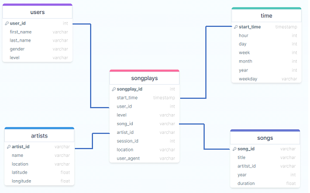
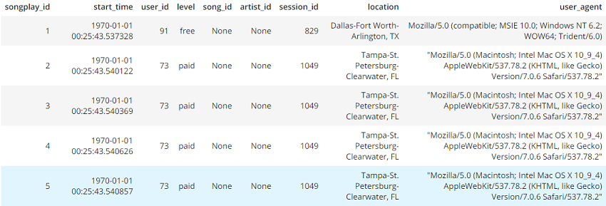

# DATA WRANGLING & DATA MODELING

## Project: Data Modeling with Postgres
*****************************************

## Table of contents
* [Introduction](#introduction)
* [Description](#description)
* [Tables](#tables)
* [Technologies](#technologies)
* [Files](#files)
* [Setup](#setup)
* [Procedures](#procedure)
* [Queries](#queries)
* [Conclusion](#conclusion)


### Introduction

A music streaming company called Sparkify needs a data engineer to organize the overwhelming amount of data that is coming in via their new music streaming app. Sparkify’s data analysts need an experienced engineer to create a Postgres database organized and aimed at optimizing data queries on the music their patrons are enjoying. The data is currently stored in JSON logs and JSON metadata on the app. 

The data engineer will be tasked with designing, constructing, and implementing a database schema and ETL pipeline to help the analysts make sense of all the data they have and dat they will potentially acquire. The company has expressed the desire to use a Postgres database because they are familiar with this particular DBMS. 
____________________

### Description

The data engineer will create a star schema that incorporates a fact table and four dimension tables.
#### Fact Table:

* Songplays 

```python
songplay_table_create = ("""
CREATE TABLE IF NOT EXISTS songplays (
  songplay_id SERIAL PRIMARY KEY,
  start_time TIMESTAMP NOT NULL,
  user_id INT NOT NULL,
  level VARCHAR,
  song_id VARCHAR,
  artist_id VARCHAR,
  session_id INT,
  location VARCHAR,
  user_agent VARCHAR
  );
""")
```

#### Dimension Tables: 

* Users

```python
user_table_create = ("""
CREATE TABLE IF NOT EXISTS users (
  user_id INT PRIMARY KEY,
  first_name VARCHAR,
  last_name VARCHAR,
  gender VARCHAR,
  level VARCHAR
  );  
""")
```

* Songs

```python
song_table_create = ("""
CREATE TABLE IF NOT EXISTS songs (
  song_id VARCHAR PRIMARY KEY,
  title VARCHAR NOT NULL,
  artist_id VARCHAR NOT NULL,
  year int,
  duration FLOAT NOT NULL
  );
""")
```

* Artists
```python
artist_table_create = ("""
CREATE TABLE IF NOT EXISTS artists (
  artist_id VARCHAR PRIMARY KEY,
  name VARCHAR NOT NULL,
  location VARCHAR,
  latitude FLOAT,
  longitude FLOAT
  );
""")
```

* Time

```python
time_table_create = ("""
CREATE TABLE IF NOT EXISTS time (
  start_time TIMESTAMP PRIMARY KEY,
  hour INT,
  day INT, 
  week INT,
  month INT,
  year INT,
  weekday VARCHAR
  ); 
""")
```

### Tables



### Technologies

As per the request of the customer, the programs and DBMS used:
1. Python
2. Jupyter
3. PostgreSQL
-------------

### Files

Along with the internal customer files, log_data and song_data files, the following files will be utilized:
- **song_data files**
 * The **Million Song Dataset** contains **JSON** formatted metadata about each song and artist. The files are loaded via:
 
```python
song_files = get_files("data/song_data")
filepath = song_files[0]
df = pd.read_json(filepath, lines=True)
```

- **log_data**
 * The log files are also in **JSON** format. The log files are organzied by date, such as year and month. The files are loaded via:
 

```python
log_files = get_files("data/log_data")
filepath = log_files[0]
df = pd.read_json(filepath, lines=True)
```

- **sql_queries.py**
 * The sql script to create, drop and insert tables and values from the log_data and song_data files.
- **create_tables.py**
 * The Python file to drop and then create tables in the DBMS.
- **test.ipynb**
 * The file to run the updated work and for troubleshooting and that tests the final work.
- **etl.ipynb**
 * The file to run the song_data and log_data and to store them into the tables. Contains instructions for the ETL processes. 
- **etl.py**
 * The final file to process the song_data and log_data and have them stored into the test.ipynb file.

_________________________

### Setup

1. Secure a connection with the local PostgreSQL server.
2. Execute the **python create_tables.py** command to drop, create, and insert data into DBMS.
3. Execute **test.ipynb** after following the steps in etl.ipynb to verify tables are created.
4. Run the **etl.py** file to complete the ETL process and to complete the test.ipynb file.
______________

### Procedures

- #### Drop, Create, Insert

1. In **sql_queries.py** fill in the code for the **CREATE** statements for each of the tables.
2. Fill in the additional **DROP** statements at the top of the **sql_queries.py** file.
3. Execute **create_tables.py** in terminal to create tables in the database.
4. Execute **test.ipynb** to verify functionality of the tables just created.

- #### ETL Process

1. In **etl.ipynb** file perform the steps to produce the ETL process for the tables. Execute **test.ipynb** to verify the tables were inserted correctly.
2. After confirmation of correct insertions, restart the notebook so the ETL process can begin in the other files.

- #### ETL Pipeline

1. Execute the **etl.py** file when finished with **etl.ipynb** in the terminal.
2. Always execute the **create_tables.py** file first before executing the **etl.py** file. 
3. If no error occurs, then execute **test.ipynb** once again to verify functionaly of tables, inserts, and that there are no warnings or errors.

____________

### Queries

A query is needed in order to find the song ID and artist ID from th log file, but the log file does not contain any IDs for songs or artists. The song and artist IDs will be found via the songs and artists tabes based on their matching artist name, song title, and song duration.

In order to find the desired data, the **song_select** query from **sql_queries.py** will be implemented based on the title, song duration, and artist's name.

```python
song_select = ("""
SELECT s.song_id, a.artist_id
FROM songs s
JOIN artists a
ON s.artist_id = a.artist_id
WHERE s.title = %s AND a.name = %s AND s.duration = %s    
""")
```




### Conclusion

After following the steps to gather, clean, and organize the data that Sparkify needed to optimize their DBMS, they will be able to query the data needed for analysis much quicker and more easily. It will also help the data analytics team do a better job meeting the needs of their customers and for generating more business.  


